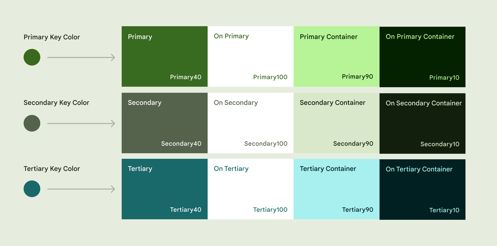
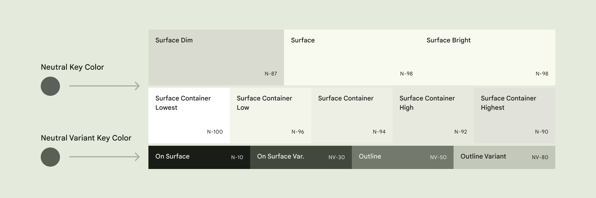
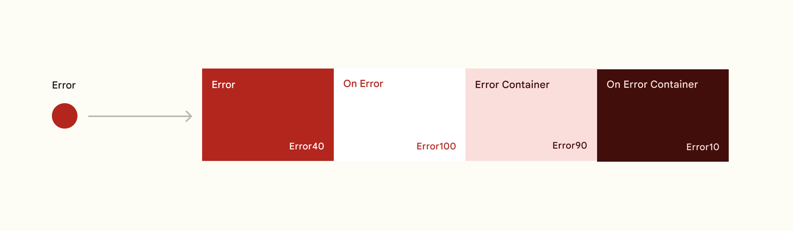
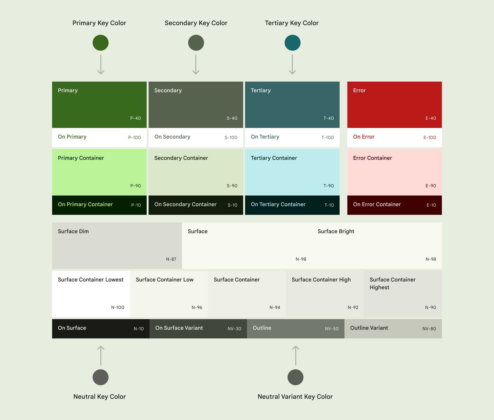
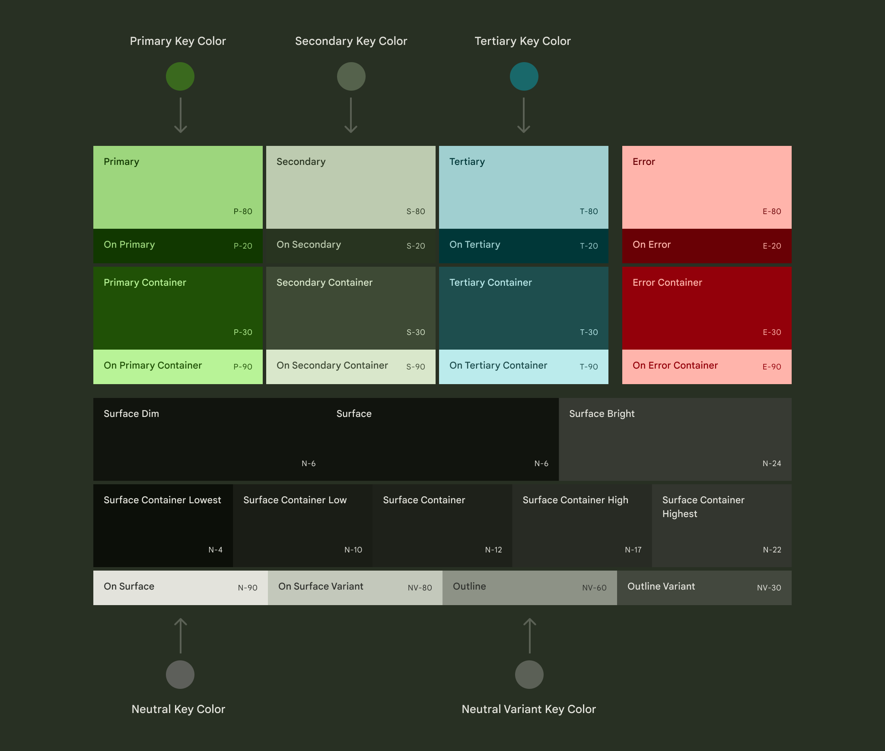

# Color

:::info
This documentation is made for developer to setup design system that already developed by UI/UX team. This documentation also flexible to all design system that want to use in the project and also help UI/UX team to understand how design system is implemented in mobile apps.
:::

Color is a critical part of any design system, but it can slip out of control easily. With a seemingly infinite number of hues and shades, variability from different color spaces, and various methods of picking and sampling colors, it’s easy for teams to end up with dozens of color values that are being used inconsistently.

By defining a color system you can ensure you have a controlled (and consolidated) palette of acceptable colors, consistent and proper usage, and also improve ease of maintenance. 

## Key Colors
### Accent Colors
- **Primary** key color is used to derive roles for key components across the UI, such as the FAB, prominent buttons, active states, as well as the tint of elevated surfaces.

- **Secondary** key color is used for less prominent components in the UI such as filter chips, while expanding the opportunity for color expression.

- **Tertiary** key color is used to derive the roles of contrasting accents that can be used to balance primary and secondary colors or bring heightened attention to an element. The tertiary color role is left for teams to use at their discretion and is intended to support broader color expression in products.



  
  
### Neutral Colors
- **Neutral** key color is used to derive surface color roles for backgrounds, as well as colors used for high emphasis text and icons.

- **Neutral variant** key color is used to derive color roles for medium emphasis elements like text, icons, and component outlines. 




## Additional Colors

- **Error** color In addition to the accent and neutral key color, the color system includes a semantic color role for error, again in the form of the error role itself, plus an on-error, error container, and on-error container role. 




- **Divider** color is for separted item on list.

- **Shadow** color for widget that has shadow.


## Color Roles

Each key accent color (primary, secondary, and tertiary) is provided as a group of 4 compatible colors with different tones that can be applied for differing emphasis and visual expression, and paired for visual contrast.

Accent colors: Primary, secondary, and tertiary roles are formed following the same pattern of a 4-color group.

Primary is used here as an example:

- **Primary** base color
- **On-primary** is applied to content (icons, text, etc.) that sits on top of primary
- **Primary container** is applied to elements needing less emphasis than primary
- **On-primary container** is applied to content (icons, text, etc.) that sits on top of primary container

For more color role sample [check this](https://m3.material.io/styles/color/the-color-system/color-roles#daaa199a-3394-4bbf-9eb2-9d4a2b5e1e5a).

### Light
Example light mode color:



### Dark
Example dark mode color:



## Implementation
On mobile apps we've created interface class called `ThemeColor` you can find at `lib/core/theme`, so with that class we can create more than one theme based on ThemeColor (theme > 1 not only light and dark theme). The class have properties:

```js
Brightness get brightness;
Color get primary;
Color get primaryContainer;
Color get secondary;
Color get secondaryContainer;
Color get tertiary;
Color get tertiaryContainer;
Color get background;
Color get surface;
Color get surfaceVariant;
Color get outline;
Color get outlineVariant;
Color get error;
Color get errorContainer;
Color get onPrimary;
Color get onPrimaryContainer;
Color get onSecondary;
Color get onSecondaryContainer;
Color get onTertiary;
Color get onTertiaryContainer;
Color get onBackground;
Color get onSurface;
Color get onSurfaceVariant;
Color get onError;
Color get onErrorContainer;
Color get divider;
Color get shadow;
```

Sample of inheritanced class for ThemeColor are LightColor & DarkColor class (theme that usually implemented are light and dark).

This theme color config place in Styles a singleton class that can be found at `lib/core/theme/style.dart` The settings of color theme are set there.


### Usage
```js
// use from theme context
Theme.of(context).colorScheme.primary

// or use styles 
Styles().color.primary
```