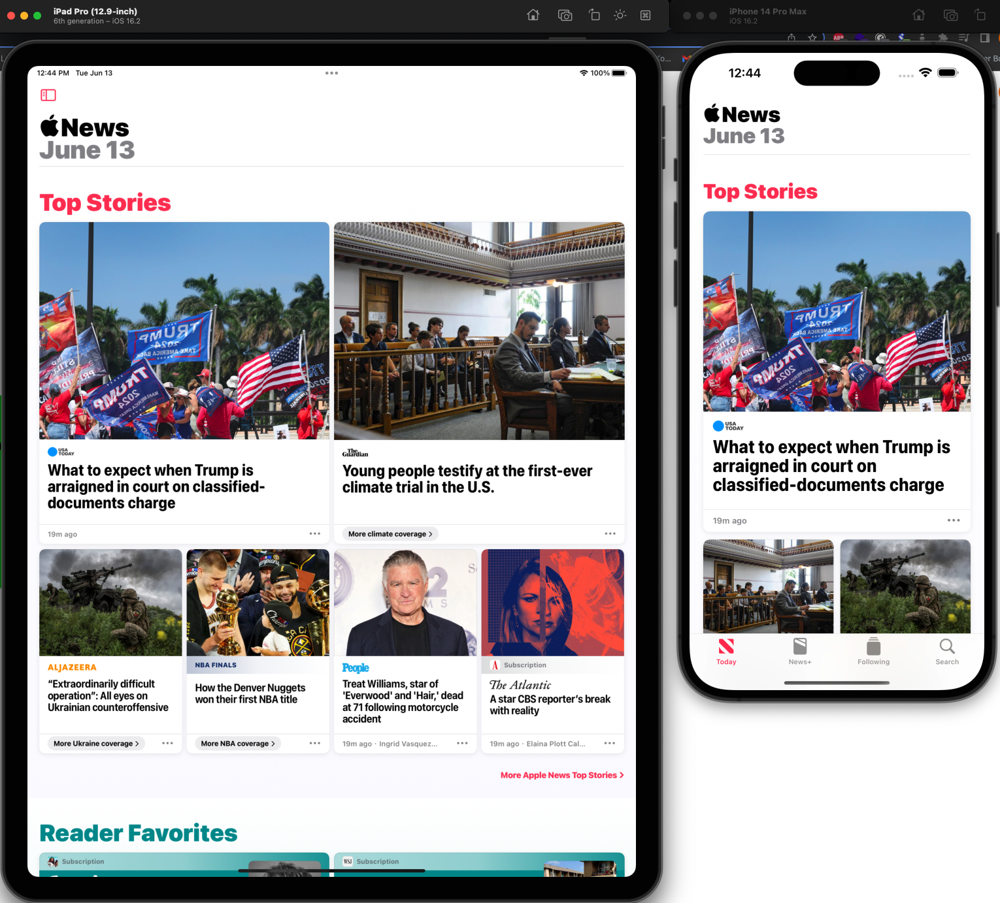

:::info
This documentation is made for developer to setup design system that already developed by UI/UX team. This documentation also flexible to all design system that want to use in the project and also help UI/UX team to understand how design system is implemented in mobile apps.
:::

When you think about mobile screens think of designing for the smallest screen, then make it responsive to larger screens. Device that has large screen are Ipad 12.9 inch, Ipad 11 inch, Tablet 10 inch etc.



## Implementation
There are responsive widget that based on breakpoint at `Styles` just import it and use.

The breakpoint can be change based on android and iOS device. See [here](https://developer.android.com/guide/topics/large-screens/support-different-screen-sizes) for android and [here](https://www.ios-resolution.com/) for iOS.

```js
// Usage
return Responsive(
    largeScreen: LargeScreenWidget(),
    mediumScreen: MediumScreenWidget(),
    smallScreen: SmallScreenWidget(),
    xtraSmallScreen: XtraSmallScreenWidget(),
);

// Method only to check screen
Responsive.isLargeScreen(context) // return boolean
Responsive.isMediumScreen(context) // return boolean
Responsive.isSmallScreen(context) // return boolean
Responsive.isXtraSmallScreen(context) // return boolean

```