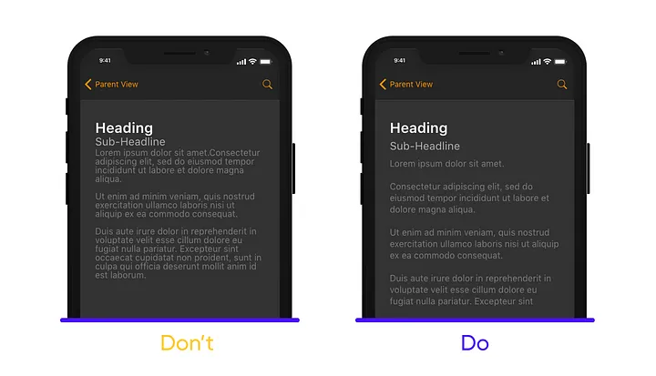

:::info
This documentation is made for developer to setup design system that already developed by UI/UX team. This documentation also flexible to all design system that want to use in the project and also help UI/UX team to understand how design system is implemented in mobile apps.
:::


## Padding

The padding is the empty space between a UI component’s border and its content.

### Implementation

```js
// default padding on style
class ThemePadding {
  double p4 = 4;
  double p8 = 8;
  double p12 = 12;
  double p16 = 16;
  double p20 = 20;
  double p24 = 24;
  double p32 = 32;
  double p40 = 40;
}

```

```js
// Usage
Styles().padding.p4
Styles().padding.p16
```

## Margin

The margin is the empty space between a component and other component.

### Implementation

```js
// default padding on style
class ThemeMargin {
  double m4 = 4;
  double m8 = 8;
  double m12 = 12;
  double m16 = 16;
  double m20 = 20;
  double m24 = 24;
  double m32 = 32;
  double m40 = 40;
}

```

```js
// Usage
Styles().margin.m4
Styles().margin.m16
```


## Radius

The radius is the rounded value on corner UI component.

### Implementation

```js
// default padding on style
class ThemeRadius {
  double r4 = 4;
  double r6 = 6;
  double r8 = 8;
  double r12 = 12;
  double r16 = 16;
  double r24 = 24;
  double r32 = 32;
  double r48 = 48;
}

```

```js
// Usage
Styles().radius.r4
Styles().radius.r16 
```


## Tips

- Mobile devices have small screens as compared to desktops, fitting in a lot of information in a small mobile UI can be challenging.


 

- Design for everyone, consider multiple holds. These are three common types of holding a mobile, design the main actions within these areas.


- A small screen doesn’t mean small text, or less space, don’t let text or other elements overlap. Improve legibility by increasing line height or element spacing.
  



- New technologies are being presented every day, as a designer you need to stay up to date, for example, Curved displays increased padding my some pixels to avoid unwanted touches.


