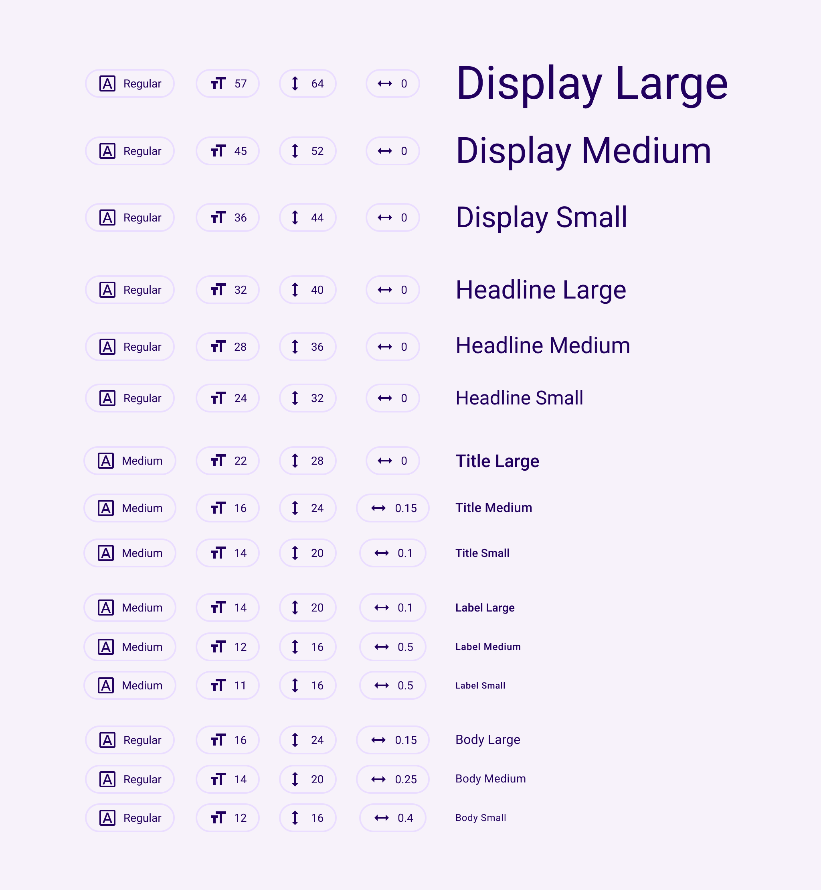

# Typography

:::info
This documentation is made for developer to setup design system that already developed by UI/UX team. This documentation also flexible to all design system that want to use in the project and also help UI/UX team to understand how design system is implemented in mobile apps.
:::

## Default Text Theme

The default font is Roboto and default propertie are:



:::info
This default font and properties can be change.
:::

## Implementation
There are two implementation of typography:

### GoogleFonts
Directly from GoogleFonts dependency, on `Styles` there are method `_globalTextTheme`

```js
// example
static _globalTextTheme(BuildContext context) {
    return GoogleFonts.ubuntuTextTheme(
        Theme.of(context).textTheme.copyWith(
            displayLarge: GoogleFonts.ubuntu(color: _singleton.color.onSurface),
            displayMedium:GoogleFonts.ubuntu(color: _singleton.color.onSurface),
            displaySmall: GoogleFonts.ubuntu(color: _singleton.color.onSurface),
            headlineMedium:GoogleFonts.ubuntu(color: _singleton.color.onSurface),
            headlineSmall:GoogleFonts.ubuntu(color: _singleton.color.onSurface),
            titleLarge: GoogleFonts.ubuntu(color: _singleton.color.onSurface),
            titleMedium: GoogleFonts.ubuntu(color: _singleton.color.onSurface),
            titleSmall: GoogleFonts.ubuntu(color: _singleton.color.onSurface),
            bodyLarge: GoogleFonts.ubuntu(color: _singleton.color.onSurface),
            bodyMedium: GoogleFonts.ubuntu(color: _singleton.color.onSurface),
            labelLarge: GoogleFonts.ubuntu(color: _singleton.color.onSurface),
            bodySmall: GoogleFonts.ubuntu(color: _singleton.color.onSurface),
            labelSmall: GoogleFonts.ubuntu(color: _singleton.color.onSurface),
            ),
    );
}

```

### Assets
- Import the font files to assets folder at `your_app/assets/fonts/`.

Flutter supports the following font formats:
.ttc
.ttf
.otf

- Declare the font in the pubspec
```ruby
flutter:
  fonts:
    - family: Raleway
      fonts:
        - asset: fonts/Raleway-Regular.ttf
        - asset: fonts/Raleway-Italic.ttf
          style: italic
    - family: RobotoMono
      fonts:
        - asset: fonts/RobotoMono-Regular.ttf
        - asset: fonts/RobotoMono-Bold.ttf
          weight: 700

```

### Usage
The default font on your app should be change after you config it, then you just to adjust the size and weight based on your text. 

```js
// using theme context
Theme.of(context).textTheme.displayLarge
```