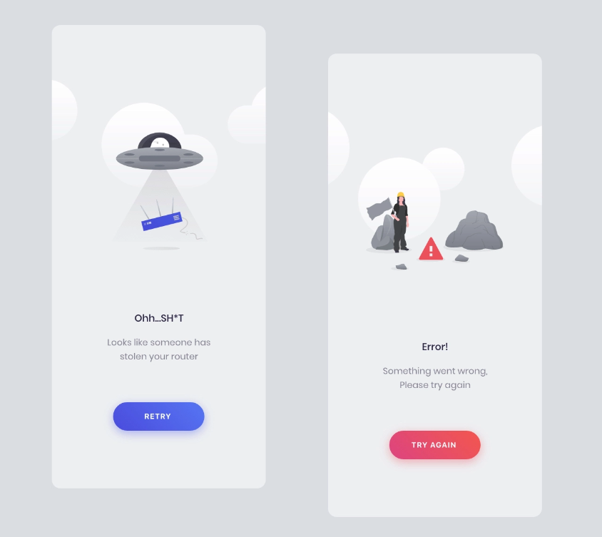
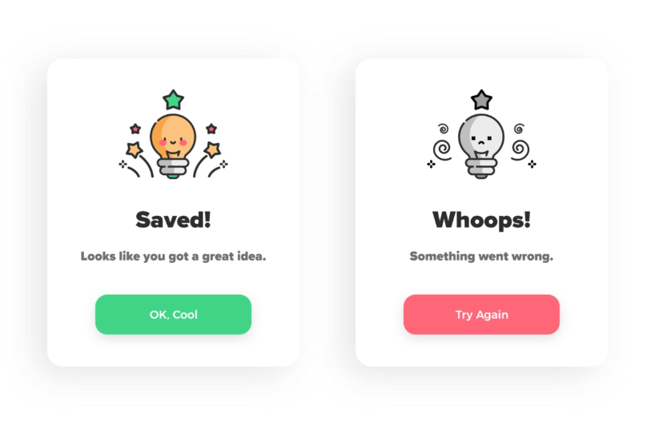
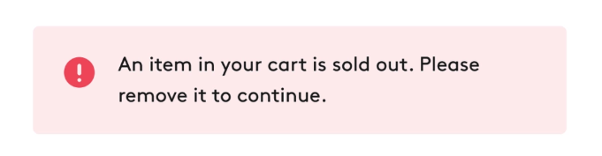

# Error Widget

:::info
This documentation is made for developer to setup design system that already developed by UI/UX team. This documentation also flexible to all design system that want to use in the project and also help UI/UX team to understand how design system is implemented in mobile apps.
:::

## Utility

Error widget is used to inform the user that error is occured. 
- Error Widget Custom
- Error Dialog
- Error snackbar / Toast
  
## Type
There are commonly used error widget below:

### Error Widget Custom
This error widget is used for getting data process error, such as **getting list**, **getting detail**, **empty state**, **error initial connection** and etc. The widget is sticked on layout when error appeared. Example error widget custom:



### Error Dialog
This dialog is used for submit data process error, such as **login failed**, **submit data failed**, **validation error** and etc. The widget is poped up when error appeared. Example error dialog:



### Error Snackbar and Toast
Same as dialog this snackbar is used for submit data process error but with simple message error, such as **login failed**, **submit data failed**, **validation error** and etc. The widget is poped up at the bottom of layout when error appeared. The different between snackbar and toast is **snackbar body can be swiped out but toast is not**.  Example error snackbar:




## Implementation

On project you can add error widget to `lib/core/widget/error`.
For toast or snackbar you can use Toast class located on `lib/core/widget/toast`.

```js
// Toast usage
Toast.showToast(
    message: 'Aw snap',
    iconColor: Styles().color.error,
    iconData: Icons.error_outline_rounded,
    durationMiliseconds: 3000,
);

// Snackbar usage
Toast.showSnackBar(
    context,
    message: 'Aw snap',
    iconColor: Styles().color.error,
    iconData: Icons.error_outline_rounded,
    durationMiliseconds: 3000,
    onPressed: () {},
);
```