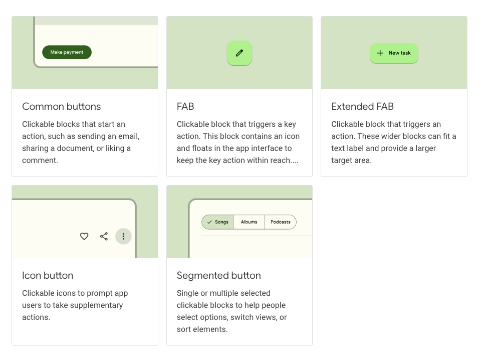
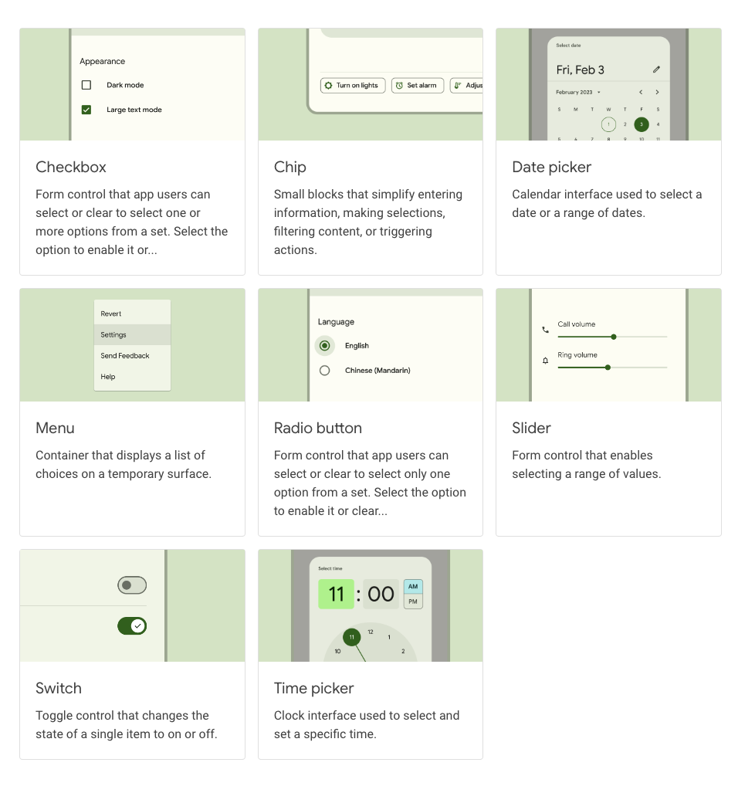
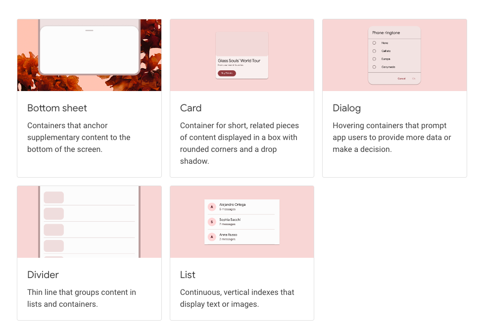

# Global Widgets

:::info
This documentation is made for developer to setup design system that already developed by UI/UX team. This documentation also flexible to all design system that want to use in the project and also help UI/UX team to understand how design system is implemented in mobile apps.
:::

Global widgets are design system widget that commonly used such as button, text field etc.

## Catalog
Below is example default widgets :
:::success
This default widget can be modified based on design system
:::

For more default widgets catalog [check this](https://docs.flutter.dev/ui/widgets).

## Implementation

On project you can add design system widget to `lib/core/widget`.