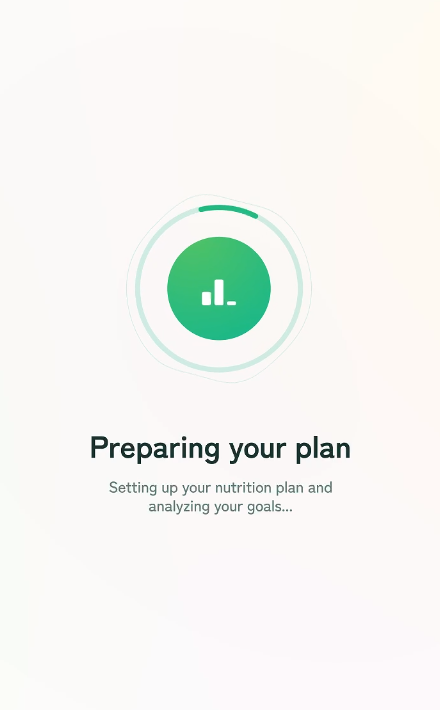
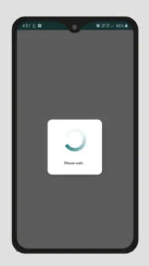

# Loading Widget

:::info
This documentation is made for developer to setup design system that already developed by UI/UX team. This documentation also flexible to all design system that want to use in the project and also help UI/UX team to understand how design system is implemented in mobile apps.
:::

Loading widget is Widget that appears when loads something that takes time.

## Type

### Circular Progress Indicator
This type commonly used in getting data process. Example:

### Shimmer
This type commonly used in getting data process. Example:

### Pop Up Loading
This type commonly used in submit data process. Example:

### Custom Animation Loading
You can build animation using [lottie](https://lottiefiles.com/) or [rive](https://rive.app/).

## Implementation

On project you can add loading widget to `lib/core/widget/loading`.