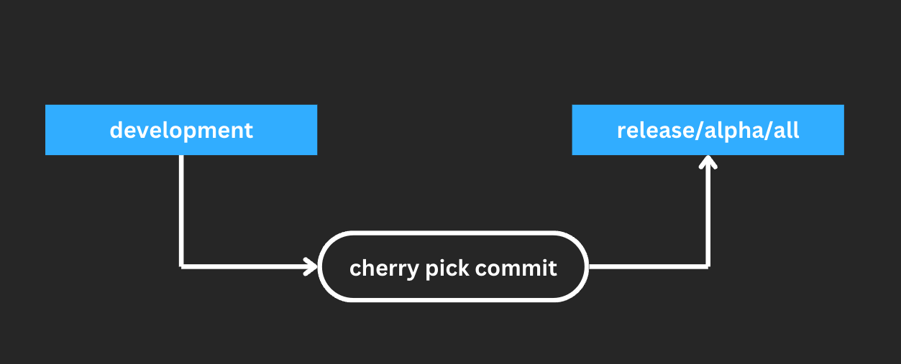
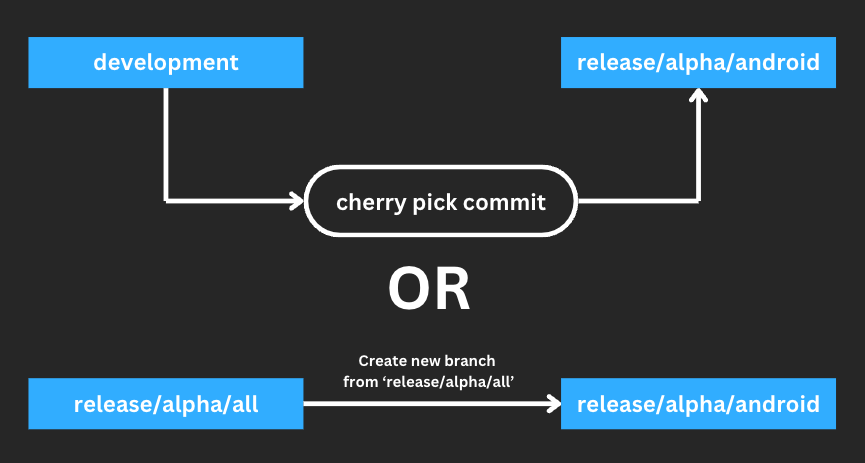
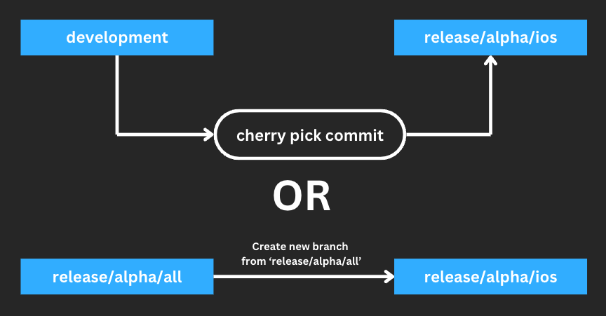
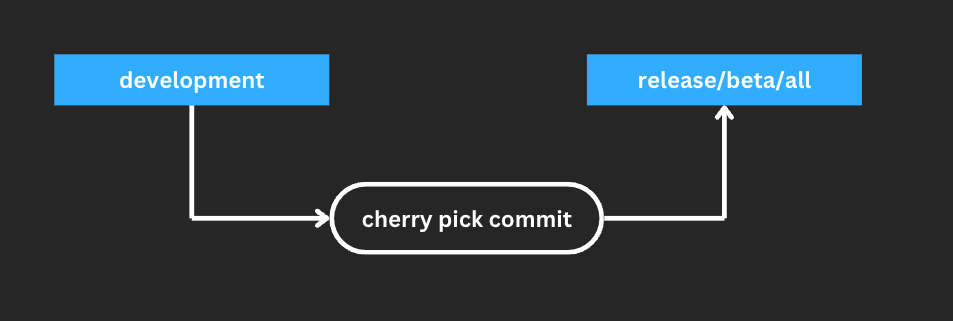
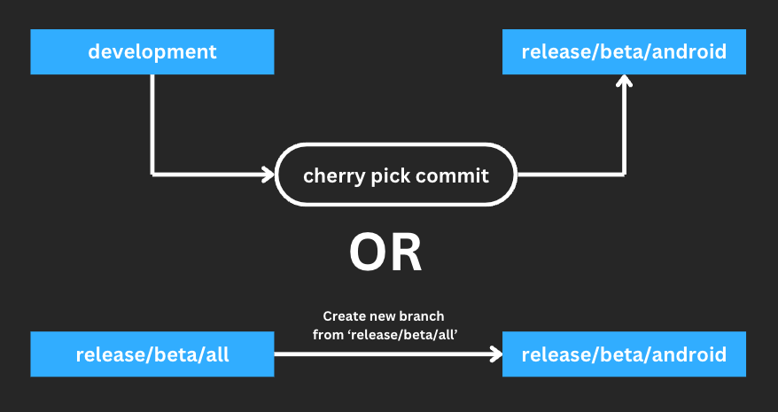
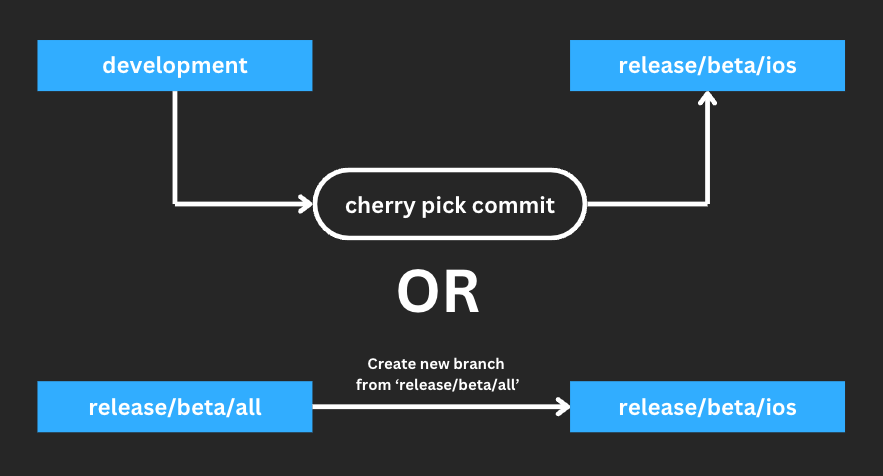
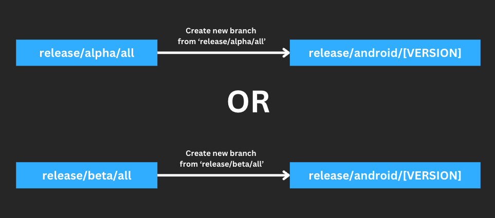
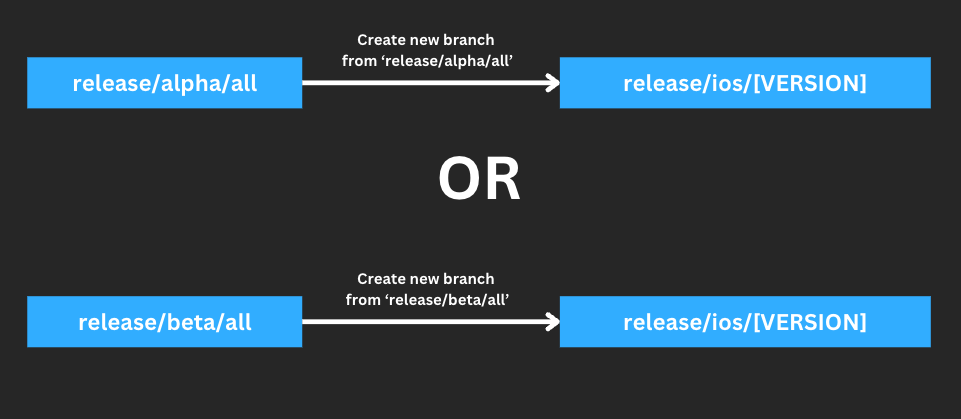

# Github Action

We use github action as ci/cd service for our apps. 

:::info
We use alpha, beta and stable release type witch specification below:
- `alpha` => use DEV environment & DEV flavor, deploy to Firebase App Distribution
- `beta` => use PROD environment & PROD flavor, deploy to Firebase App Distribution
- `stable` => use PROD environment & PROD flavor, deploy to Google Play or App Store
:::

## Deploy Alpha Rule
### All (Android & iOS)

- From branch `development`, cherry pick commit to branch `release/alpha/all`
- Make sure the pick commit is correct (run and build if necessary)
- Run script to update version first on local. This script is auto push to `release/alpha/all` after update version, here the [script](./release-script#versioning)
- If workflow failed because usage minutes limit is runs out then use [script](./release-script) on local.
  
### Android Only

- From branch `development`, cherry pick commit to branch `release/alpha/android`
- Make sure the pick commit is correct (run and build if necessary)
- Run script to update version first on local. This script is auto push to `release/alpha/android` after update version, here the [script](./release-script#versioning)
- If the workflow run succesfull then remove branch `release/alpha/android`
- If workflow failed because usage minutes limit is runs out then use [script](./release-script) on local.

or

- If bumped version latest commit is already exist
- Create branch from `release/alpha/all`, name it `release/alpha/android`
- Make sure the pick commit is correct (run and build if necessary)
- Then push to `release/alpha/android`
- If the workflow run succesfull then remove branch `release/alpha/android`
- If workflow failed because usage minutes limit is runs out then use [script](./release-script) on local.
- 
### iOS Only

- From branch `development`, cherry pick commit to branch `release/alpha/ios`
- Make sure the pick commit is correct (run and build if necessary)
- Run script to update version first on local. This script is auto push to `release/alpha/ios` after update version, here the [script](./release-script#versioning)
- If the workflow run succesfull then remove branch `release/alpha/ios`
- If workflow failed because usage minutes limit is runs out then use [script](./release-script) on local.
  
or

- If bumped version latest commit is already exist
- Create branch from `release/alpha/all`, name it `release/alpha/ios`
- Make sure the pick commit is correct (run and build if necessary)
- Then push to `release/alpha/ios`
- If the workflow run succesfull then remove branch `release/alpha/ios`
- If workflow failed because usage minutes limit is runs out then use [script](./release-script) on local.
  
## Deploy Beta Rule
### All (Android & iOS)

- From branch `development`, cherry pick commit to branch `release/beta/all`
- Make sure the pick commit is correct (run and build if necessary)
- Run script to update version first on local. This script is auto push to `release/beta/all` after update version, here the [script](./release-script#versioning)
- If workflow failed because usage minutes limit is runs out then use [script](./release-script) on local.
  
### Android Only

- From branch `development`, cherry pick commit to branch `release/beta/android`
- Make sure the pick commit is correct (run and build if necessary)
- Run script to update version first on local. This script is auto push to `release/beta/android` after update version, here the [script](./release-script#versioning)
- If the workflow run succesfull then remove branch `release/beta/android`
- If workflow failed because usage minutes limit is runs out then use [script](./release-script) on local.
  
or

- If bumped version latest commit is already exist
- Create branch from `release/beta/all`, name it `release/beta/android`
- Make sure the pick commit is correct (run and build if necessary)
- Then push to `release/beta/android`
- If the workflow run succesfull then remove branch `release/beta/android`
- If workflow failed because usage minutes limit is runs out then use [script](./release-script) on local.
  
### iOS Only

- From branch `development`, cherry pick commit to branch `release/beta/ios`
- Make sure the pick commit is correct (run and build if necessary)
- Run script to update version first on local. This script is auto push to `release/beta/ios` after update version, here the [script](./release-script#versioning)
- If the workflow run succesfull then remove branch `release/beta/ios`
- If workflow failed because usage minutes limit is runs out then use [script](./release-script) on local.
  
or

- If bumped version latest commit is already exist
- Create branch from `release/beta/all`, name it `release/beta/ios`
- Make sure the pick commit is correct (run and build if necessary)
- Then push to `release/beta/ios`
- If the workflow run succesfull then remove branch `release/beta/ios`
- If workflow failed because usage minutes limit is runs out then use [script](./release-script) on local.

## Deploy Stable Rule

### Android

- Create branch from `release/alpha/all` or `release/beta/all`, name it `release/android/[VERSION]`
- Make sure the pick commit is correct (run and build if necessary)
- Then push to `release/android/[VERSION]`
- If workflow failed because usage minutes limit is runs out then use [script](./release-script) on local.

:::note
Change `[VERSION]` with semantic version based on your app, example: release/android/1.2.1 
:::

### iOS

- Create branch from `release/alpha/all` or `release/beta/all`, name it `release/ios/[VERSION]`
- Make sure the pick commit is correct (run and build if necessary)
- Then push to `release/ios/[VERSION]`
- If workflow failed because usage minutes limit is runs out then use [script](./release-script) on local.
  
:::note
Change `[VERSION]` with semantic version based on your app, example: release/ios/1.2.1 
:::