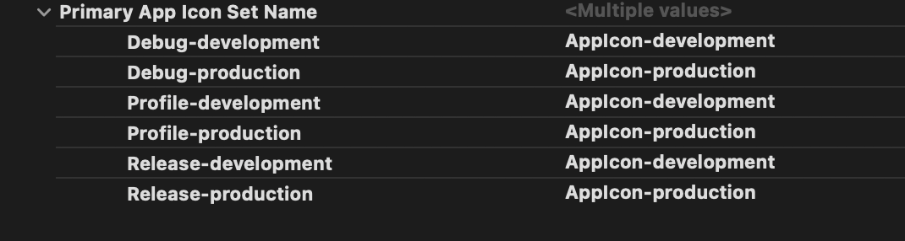

# App Icon Flavors

## App Icons for Android and iOS

We will use [flutter_launcher_icons](https://pub.dev/packages/flutter_launcher_icons) to generate the launch icons for each flavor.

- create `flutter_launcher_icons-<flavor>.yaml` files for each flavor.
  
  ```js title=<ROOT>/flutter_launcher_icons-development.yaml
  flutter_icons:
  android: true
  ios: true
  remove_alpha_ios: true
  image_path: "assets/images/dev-icon`.png"
  ```

  ```js title=<ROOT>/flutter_launcher_icons-production.yaml
  flutter_icons:
  android: "ic_laucher"
  ios: true
  remove_alpha_ios: true
  image_path: "assets/images/klob-ios.png"
  image_path_android: "assets/images/klob-android.png"
  ```

- Generate the launch icons we need to run
  
  ```shell
  flutter pub run flutter_launcher_icons:main -f flutter_launcher_icons-*
  ```

- In Android this will auto genereated the directories for each flavor, and we will set the iOS icons to be dynamic in Xcode. In `Runner` -> `Assets.xcassets` we can see that we have all the required icons.
  
- In `Target`-> `Runner` -> `Build Settings`, search for `primary app icon`.
  
  

- Set the corresponding suffix to each one.

  

- Done, launch with [this](./launch-flavors)
