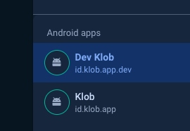
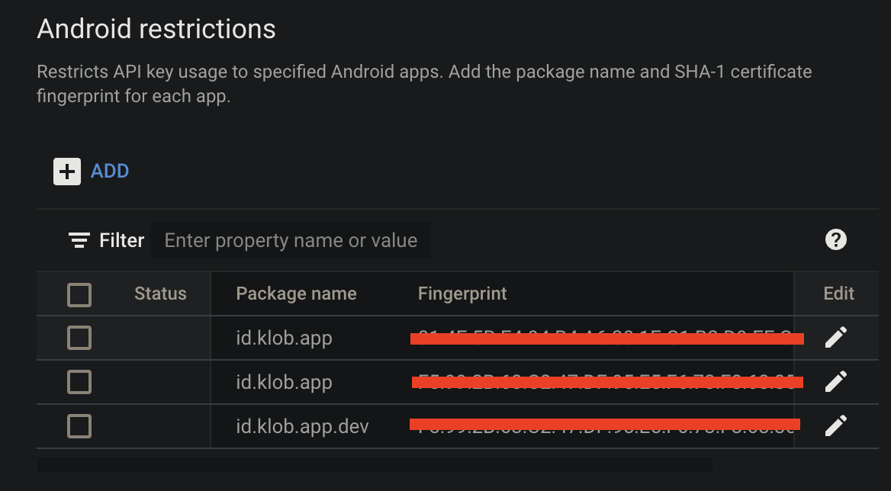
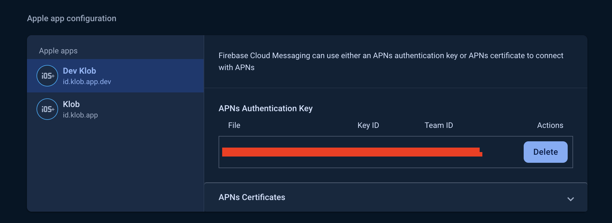
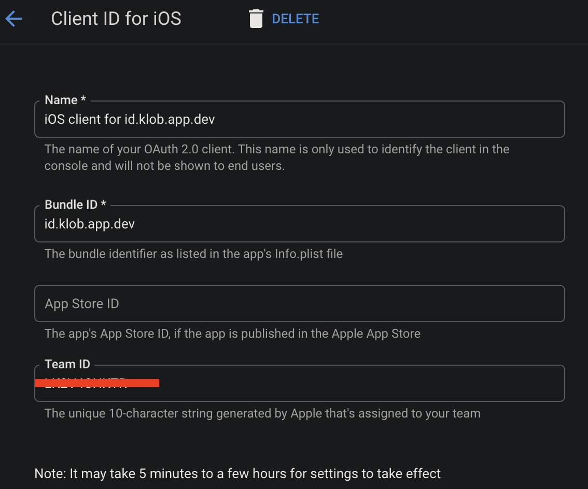
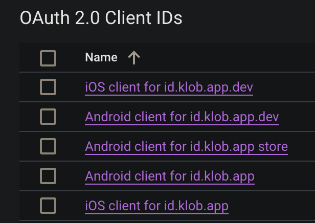
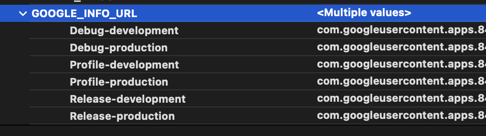
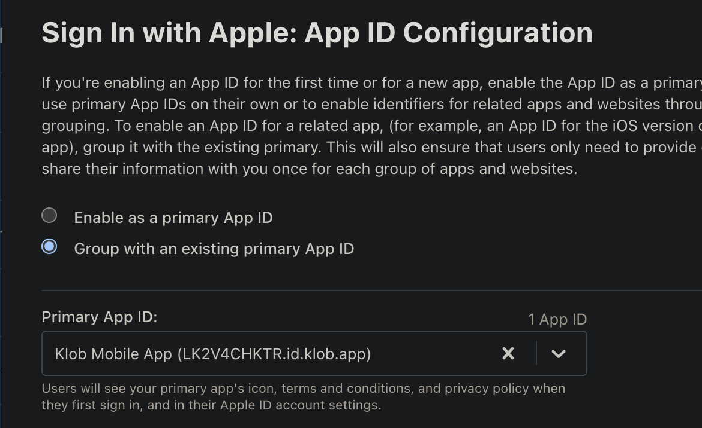

# Reconfigured Services


## Services That Need To be Reconfigured

Services that need to be considered when using flavors to reconfigure *if using it*, there are:

### Firebase Cloud Messaging

#### Android
- On Firebase Console, Ensure all flavor has registered on firebase app
  
  

- On [Google cloud console](https://console.cloud.google.com/), go to `credentials` see `API Keys` section and `select your API Key for android`, then add your new bundle id on `restrictions` section based on flavor

  

- Still on `credentials` section, `create new credentials` select `OAuth Client ID` , Select `Application Type` as `Android`, Fill `Name`, `Package Name` & `SHA-1` based on your flavor, then save.
  
  

- Back to your `Firebase Console`, and download again each config and place it on flavor directory. Make sure firebase config is placed at correct flavor

- Finally test FCM notification.

#### iOS
- On Firebase Console, Ensure all flavor has registered on firebase app
  
  

- Still on `Firebase Console`, go to `Cloud Messaging` section, and scroll to `Apple App Configuration` then add `APNs Authentication Key` based on flavor
  
  

- On [Google cloud console](https://console.cloud.google.com/), go to `credentials`, then `create new credentials` select `OAuth Client ID`, Select `Application Type` as `iOS`, Fill `Name`, `Bundle ID` & `TEAM ID` based on your flavor, then save.

  

- Back to your `Firebase Console`, and download again each config and place it on flavor directory. Make sure firebase config is placed at correct flavor

- Finally test FCM notification.


### AppLink

#### Android
- On Firebase Console, Ensure all `SHA certificate fingerprints` has registered on firebase app correctly.
  
- Also on [Google cloud console](https://console.cloud.google.com/), Ensure all `fingerprints` at API Key and OAuth Clien ID

  

  

- Add different `assetlinks.json` based on your flavors, example: 

  - production
    ```json title=assetlinks.json
    [
      {
        "relation": ["delegate_permission/common.handle_all_urls"],
        "target": {
          "namespace": "android_app",
          "package_name": "id.klob.app",
          "sha256_cert_fingerprints": [
            <YOUR-SHA256>
          ]
        }
      },
    ]
    ```
  - development
    ```json title=assetlinks.json for development
    [
      {
        "relation": ["delegate_permission/common.handle_all_urls"],
        "target": {
          "namespace": "android_app",
          "package_name": "id.klob.app.dev",
          "sha256_cert_fingerprints": [
            <YOUR-SHA256>
          ]
        }
      },
    ]
    ```

- Done, test your applink


#### iOS

- Add different `apple-app-site-association` based on your flavors. example:

  - production
    ```json title=apple-app-site-association
    {
      "applinks": {
        "apps": [],
        "details": [
          {
            "appID": "LK2V4CHKTR.id.klob.app",
            "paths": [
               <YOUR-PATHS>
            ]
          }
        ]
      }
    }
    ```
  - development
    ```json title=apple-app-site-association for development
    {
      "applinks": {
        "apps": [],
        "details": [
          {
            "appID": "LK2V4CHKTR.id.klob.app.dev",
            "paths": [
              <YOUR-PATHS>
            ]
          }
        ]
      }
    }
    ```

- Done, test your applink


### Sign In With Google

#### Android
- On [Google cloud console](https://console.cloud.google.com/), ensure all `Bundle ID` and  is registered correctly based on flavor at `Android API Key`

  

- Ensure All flavor `OAuth Client ID` is registered on cloud console.

  

- Done, test the service

#### iOS
- Ensure All flavor `OAuth Client ID` is registered on cloud console.

  

- Go to xcode, `Target` -> `runner` -> `Build Settings`, click on the `+` button, and create a new user-defined variable name it `GOOGLE_INFO_URL`. Then paste the `REVERSED_CLIENT_ID` from `ios/config/<FLAVOR_NAME>/GoogleService-Info.plist` based on scheme
  
  

- Then at `Info.plist` change `CFBundleURLSchemes` became:
  
  ```xml title=Info.plist
  <array>
		<dict>
			<key>CFBundleTypeRole</key>
			<string>Editor</string>
			<key>CFBundleURLSchemes</key>
			<array>
				<string>$(GOOGLE_INFO_URL)</string>
			</array>
		</dict>
	</array>
  ```

- Done, test the service

### Sign In With Apple

#### Android

- On `environment.dart` add new var below:

  ```dart title=lib/core/environment/environment.dart
  @override
  String get appleSignInClientId => Constant.appleSignInClientIdProd;

  @override
  String get appleSignInRedirectUrl => Constant.appleSignInRedirectUrlProd;
  ```

  add all var config on all environment.

  :::note
  `appleSignInClientId` and `appleSignInRedirectUrl` is different between flavor, so the service id is different

  
  :::

- Done, test the service

#### iOS

- Ensure on bundle id flavor has capabilities `Sign In with Apple`
  
  
  
- Click edit, and make sure `Group with an existing primary App ID` is selected and primary app ID choose to the prodcution app (*`This is only for non-production, the production one keep as is`*)

  

- Done, test the service

