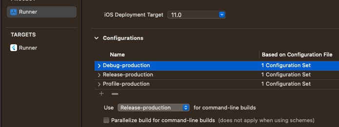
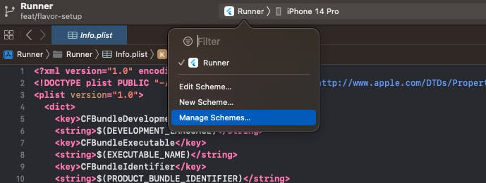
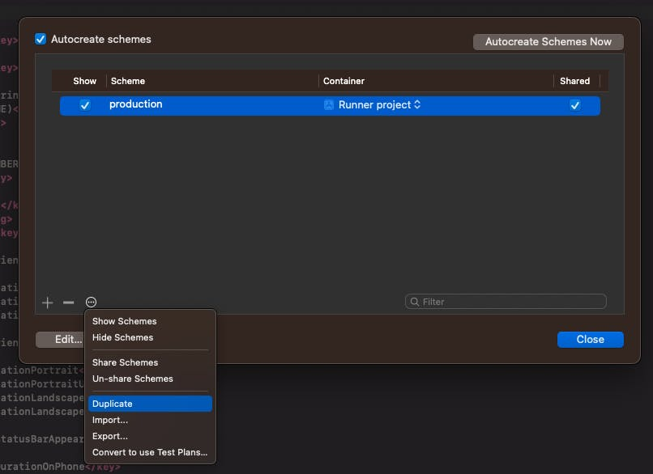
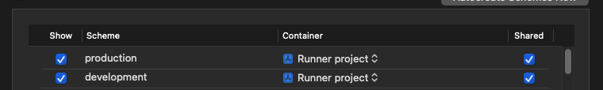
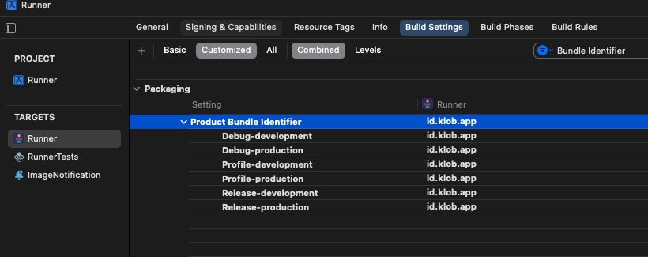
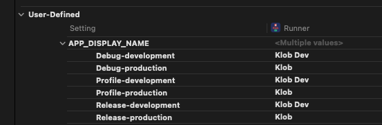

# Setup Flavors

Flavors (known as build configurations in iOS and macOS), allow you (the developer) to create separate environments for your app using the same code base. For example, you might have one flavor for your full-fledged production app, another as a limited "free" app, another for testing experimental features, and so on.

- Flavors allow efficient management of different development environments (development, staging, production)

- Enables creation of multiple versions of the same app (free and paid versions, separate environments for feature development)

- Simplifies setting different parameters (API endpoints, API keys, app icons) for each configuration

- Makes it easier to manage different app versions

## Setting Up Flavors
Manually adding flavors to an app may be the best course of action. This process requires a bit of human touch, but it provides complete control over the configuration of your app's flavors.

We will be setting up **`development`** and **`production`** flavors. 

## Android
### 1. Register bundle id to firebase project
Assume we have created a Firebase Android app before and that is for production, then we must creat new Firebase Android app with new bundle id based on flaver usually has bundle id suffix `.dev`.
If you don't have the Firebase Android app at all, we must add all Firebase Android app to Firebase project based on flavor that we want to config.

We will use **`development`** and **`production`** flavors, so we have 2 Firebase Android app for production and development


### 2. Create directory each flavors
Create directory on **`android/app/src/<your-flavors>`** and locate your Firebase config to directory based on your flavors.


### 3. Add flavors in build.gradle
To add production and development flavors, let's make some changes in the app level build.gradle in **`android/app/build.gradle`** file.
   
   ```js title=android/app/build.gradle
   flavorDimensions 'default'

   productFlavors {
      production {
         dimension 'default'
         resValue "string", "app_name", "Klob"
      }

      development {
         dimension 'default'
         applicationIdSuffix '.dev'
         resValue "string", "app_name", "Klob Dev"
      }
   }
   ```

   The *`flavorDimensions`* line defines the name of the flavor dimension, which is default in this case. Each flavor is defined within the *`productFlavors`* block. The production flavor is the base flavor of the app.

### 4. Run flavor with command

```shell
# flavor development
flutter run --flavor development --dart-define=ENVIRONMENT=DEV

# flavor production
flutter run --flavor production --dart-define=ENVIRONMENT=PROD
```

or if you're using VS Code, [use this](./launch-flavors#launch-flavor-for-vs-code).


## iOS
### 1. Register bundle id to firebase project
Assume we have created a Firebase iOS app before and that is for production, then we must creat new Firebase iOS app with new bundle id based on flaver usually has bundle id suffix `.dev`.
If you don't have the Firebase iOS app at all, we must add all Firebase iOS app to Firebase project based on flavor that we want to config.

We will use **`development`** and **`production`** flavors, so we have 2 Firebase iOS app for production and development


### 2. Create directory each flavors
Create directory on **`ios/config/<your-flavors>`** and locate your Firebase config to directory based on your flavors.


### 3. Create script to copy firebase config
This is for copy config to the correct location based on build.

- Go to `Target`, Select `Runner` -> `Build Phase`, click icon `+` to create new script, name script as `Copy GoogleService-Info.plist`, paste the code below

  ```shell
  environment="default"

  # Regex to extract the scheme name from the Build Configuration
  # We have named our Build Configurations as Debug-dev, Debug-prod etc.
  # Here, dev and prod are the scheme names. This kind of naming is required by Flutter for flavors to work.
  # We are using the $CONFIGURATION variable available in the XCode build environment to extract 
  # the environment (or flavor)
  # For eg.
  # If CONFIGURATION="Debug-prod", then environment will get set to "prod".
  if [[ $CONFIGURATION =~ -([^-]*)$ ]]; then
  environment=${BASH_REMATCH[1]}
  fi

  echo $environment

  # Name and path of the resource we're copying
  GOOGLESERVICE_INFO_PLIST=GoogleService-Info.plist
  GOOGLESERVICE_INFO_FILE=${PROJECT_DIR}/config/${environment}/${GOOGLESERVICE_INFO_PLIST}

  # Make sure GoogleService-Info.plist exists
  echo "Looking for ${GOOGLESERVICE_INFO_PLIST} in ${GOOGLESERVICE_INFO_FILE}"
  if [ ! -f $GOOGLESERVICE_INFO_FILE ]
  then
  echo "No GoogleService-Info.plist found. Please ensure it's in the proper directory."
  exit 1
  fi

  # Get a reference to the destination location for the GoogleService-Info.plist
  # This is the default location where Firebase init code expects to find GoogleServices-Info.plist file
  PLIST_DESTINATION=${BUILT_PRODUCTS_DIR}/${PRODUCT_NAME}.app
  echo "Will copy ${GOOGLESERVICE_INFO_PLIST} to final destination: ${PLIST_DESTINATION}"

  # Copy over the prod GoogleService-Info.plist for Release builds
  cp "${GOOGLESERVICE_INFO_FILE}" "${PLIST_DESTINATION}"
  ```

- Locate the script below `Link Binary With Libraries`.


### 4. Create iOS schemas
- Let's make some changes to our configuration on xcode
  
  

- In Project Runner, rename `Debug`, `Release`, and `Profile` adding `-production` suffixes to each.
  
  

- Once done, we will now create these 3 files for `development` as well. You can use duplicate.
  
  
  
- Once done, we will have 6 configurations, 3 for each flavor.
  
  
  
- Select the Runner scheme and click the Manage Schemes button.
  
  
  
- Once, there rename Runner scheme to `production`, and duplicate `production` to new `development`.
  
  
  
- Make sure to add the correct build configuration while duplicating.
  
  

  
  
- Once you are done with schemes, you will have something like this.
  
  
  
- Now, let's add the bundle identifier for each configuration. In `Target` -> `Runner`, click `Build Settings` and search for `Product Bundle Identifier`.
  
  

- Add the suffix as required.
  
  
  
- Finally, we will create a new User Defined Variable called `APP_DISPLAY_NAME` which will have a different name for each configuration. In same `Target` -> `Runner` -> `Build Settings`, click on the `+` button, and create a new user-defined variable.
  
  

  

- Once, you are done with the user-defined variable, you need to change the `Info.plist` to use this variable.
  
  ```js title=ios/Runner/Info.plist
  ...
  <key>CFBundleDisplayName</key>
  <string>$(APP_DISPLAY_NAME)</string>
  ...
  ```

### 5. Run flavor with command

```shell
# flavor development
flutter run --flavor development --dart-define=ENVIRONMENT=DEV

# flavor production
flutter run --flavor production --dart-define=ENVIRONMENT=PROD
```

or if you're using VS Code, [use this](./launch-flavors#launch-flavor-for-vs-code).
