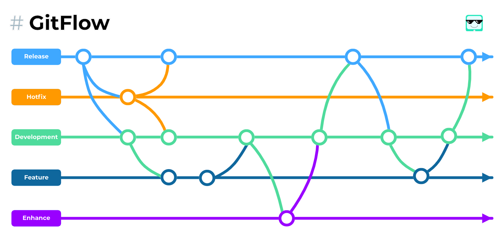

# GitFlow with Rebase Strategies
GitFlow is an alternative Git branching model that involves the use of feature branches and multiple primary branches. It was first published and made popular by [Vincent Driessen at nvie](https://nvie.com/posts/a-successful-git-branching-model). We use `GitFlow` as branching strategies for better manage multiple version of project. We use GitFlow with rebase strategies instead of using merge because when use merge if the repo has a lot of commits it can be hard to read.



## Main Branchs
The main branch is the most used default branch. The main branch is `Development`.

### Development 
The development is a branch where application developers will experiment with applications that have been made before being tested by QA and end users. This way, developers can prevent bugs before the app is ready for use by other users.


## Supporting Branches
Unlike the main branches, these branches always have a limited life time, since they will be removed eventually.

The different types of branches we may use are:
 1. Feature branches
 2. Hotfix branches
 3. Enhance branches
 3. Release branches
   
Each of these branches have a specific purpose and are bound to strict rules as to which branches may be their originating branch and which branches must be their merge targets.

### Feature branches

- May branch off from:
  
```bash
development
```

- Must merge back into:
  
```bash
development
```

- Branch naming convention:
```bash
feature/[TicketNumber]

# example:
feature/DY-79
```

Feature branches are used when developing a new feature which has the potential of a development lifespan longer than a single deployment. When starting development, the deployment in which this feature will be released may not be known. No matter when the feature branch will be finished, it will always be merged back into the <b>development</b> branch.

#### Creating a feature branch 
When starting work on a new feature, branch off from the develop branch.
```bash
$ git checkout -b feature/[TicketNumber] development
# Switched to a new branch "feature/[TicketNumber]"
```

#### Incorporating a finished feature on development
For `developer` you can `direct to pull request` on development branch and waiting for review.

For `reviewer` finished features may be merged into the develop branch to definitely add them to the upcoming release:
```bash
$ git checkout development
# Switched to branch 'development'

$ git rebase feature/[TicketNumber]
# use rebase instead of merge

$ git branch -d feature/[TicketNumber]
# Deleted branch feature/[TicketNumber] (was 05e9557).

$ git push -f origin development
```

### Release branches

Release branch has 2 type `Release Beta` and `Release Production`. 

1. Release beta is for testing and branch name contain `release/beta/[versionNumber]-b[buildNumber]`

2. Release production is for published app and branch name contain `release/prod/[versionNumber]`


Release branches

- May branch off from:
  
```bash
# BETA & PROD RELEASE
development
```

- Must merge back into:
  
```bash
# BETA & PROD RELEASE
development 
```

- Branch naming convention:
```bash
# beta release
release/beta/[versionNumber]-b[buildNumber]

# prod release
release/prod/[versionNumber]

# example:
release/beta/1.2.0-b79
release/prod/3.2.2
```

#### Creating a beta release branch 
Beta release branches are created from the development branch. The version is based on major, minor or patch update for detail yo can see versioning [here](/docs/releases/build-version). For example, say current version are 1.2.0 and we have patch update then we have decided that will become version 1.2.1, you can see comparison below:

| Update | Current Version | Current Build Number | Next version | Next Build Number (increment) |
| ------ | --------------- | -------------------- | ------------ | ----------------------------- |
| MAJOR  | 1.2.0           | 37                   | 2.0.0        | 38                            |
| MINOR  | 1.2.0           | 37                   | 1.3.0        | 38                            |
| PATCH  | 1.2.0           | 37                   | 1.2.1        | 38                            |

```bash
$ git checkout -b release/beta/1.2.1-b38 development
# Switched to a new branch "release/beta/1.2.1"

# modified your version on project and others config manually or using script then commit

$ git commit -a -m "LearningHub Beta v1.2.1 b38"
# comment must follow this pattern : "[AppName] Beta v[versionNumber] b[buildNumber]"
```

#### Finishing a beta release branch

Merge into development :
```bash
$ git checkout development
# Switched to branch 'development'

$ git rebase release/beta/1.2.1-b38
# use rebase instead of merge

# add tag with following pattern : beta-v[versionNumber]-b[buildNumber]
$ git tag -a beta-v1.2.1-b38
```

This step may well lead to a merge conflict (probably even, since we have changed the version number). If so, fix it and commit.

Branch release beta is beta count minimum 10 branches, if release beta branch > 10 then delete the oldest one. 

```bash
$ git branch -d release/beta/1.0.0-b10
# delete branch 
```


#### Creating a production release branch 
The different between beta release is naming in prod release is without build number. Release Production branch off development then create branch from development branch.

```bash
$ git checkout -b release/prod/1.2.1 development
# Switched to a new branch "release/prod/1.2.1"

# modified your version on project and others config manually or using script then commit

$ git commit -a -m "LearningHub v1.2.1 b38"
# comment must follow this pattern : "[AppName] v[versionNumber] b[buildNumber]"
```

#### Finishing a production release branch

Merge into development :
```bash
# development
$ git checkout development

$ git rebase release/prod/1.2.1
# use rebase instead of merge

# add tag with following pattern : v[versionNumber]-b[buildNumber]
$ git tag -a v1.2.1-b38
```
These step may well lead to a merge conflict (probably even, since we have changed the version number). If so, fix it and commit.


### Hotfix branches

- May branch off from:
  
```bash
release or development
```

- Must merge back into:
  
```bash
development
```

- Branch naming convention:
```bash
hotfix/[ticketNumber]

# example:
hotfix/DY-190

# if there are no ticket number you can use version number that currently fixing.
hotfix/[currentVersionBeingFixed]

# example:
hotfix/1.2.1
```

Maintenance or “hotfix” branches are used to quickly patch production releases. Hotfix branches are a lot like release branches and feature branches except they're based on main instead of develop. This is the only branch that should fork directly off of `release`. As soon as the fix is complete, make new release branch and it should be merged into `development`, and should be tagged with an updated version number.

#### Creating a production hotfix  branch 
Hotfix branches are created from the `release prod` branch. For example, say version 1.2.1 is the current production release running live and causing troubles due to a severe bug so the next version is 1.2.2 because it is patch update. But changes on develop are yet unstable. We may then branch off a hotfix branch and start fixing the problem:

```bash
$ git checkout -b hotfix/DY-190 release/prod/1.2.1
```

Then, fix the bug and commit the fix in one or more separate commits.

```bash
# example: 
$ git commit -a -m "Fixed severe production problem"

# modified your version on project and others config manually or using script then commit

$ git commit -a -m "LearningHub v1.2.2 b39"
# comment must follow this pattern : "[AppName] v[versionNumber] b[buildNumber]"
```

#### Finishing a production hotfix branch

Merge development :
```bash
$ git checkout development
# Switched to branch 'development'

$ git rebase hotfix/DY-190
# use rebase instead of merge

# add tag with following pattern : v[versionNumber]-b[buildNumber]
$ git tag -a v1.2.2-b39
```

This step may well lead to a merge conflict (probably even, since we have changed the version number). If so, fix it and commit.

The one exception to the rule here is that, `when a production release branch currently exists, the hotfix changes need to be merged into that release branch`, instead of development. Back-merging the bugfix into the release branch will eventually result in the bugfix being merged into development too.

Finally, remove the temporary branch:

```bash
$ git branch -d hotfix/DY-190
# delete branch 
```

### Enhance branches

- May branch off from:
  
```bash
development
```

- Must merge back into:
  
```bash
development
```

- Branch naming convention:
```bash
enhance/[ShorDescription]
# or
enhance/[TicketNumber]

# example:
enhance/migration
enhance/auth-optimation
enhance/DY-239
```

Feature branches are used when developing a new feature which has the potential of a development lifespan longer than a single deployment. When starting development, the deployment in which this feature will be released may not be known. No matter when the feature branch will be finished, it will always be merged back into the <b>development</b> branch.

#### Creating a enhance branch 
When starting work on a new enhance, branch off from the develop branch.
```bash
$ git checkout -b enhance/[ShortDescription] development
# Switched to a new branch "enhance-[ShorDescription]"

or
$ git checkout -b enhance/[TicketNumber] development
```

#### Creating a derivative enhance branch 
Derivative enhance branch applied if developer who do enhance more than 1.
This branch is from parent enhance-[ShorDescription] and must merge back to enhance-[ShorDescription]
```bash
$ git checkout -b enhance/[ShortDescription]/[partOfEnhance] enhance/[ShortDescription]
# example -b enhance/migration/auth

# do enhancement then commit your task

# checkout to enhance/[ShortDescription] and rebase enhance/[ShortDescription]/[partOfEnhance]

$ git checkout enhance/[ShortDescription]
$ git reabse enhance/[ShortDescription]/[developerName]
```

#### Finished enhance on development

```bash
$ git checkout development
# Switched to branch 'development'

$ git rebase enhance/[ShortDescription]
# use rebase instead of merge

$ git branch -d enhance/[ShortDescription]
# Deleted branch enhance/[ShortDescription] (was 05e9557).

$ git push -f origin development
```


## Ticket Naming Convention
Naming Convention TIKET DEVELOPMENT also BUGS
[BE], [FE], [MOBILE], [UX]

example:

```
[MOBILE] feature name
```


CONCERN QA: 
- Issue Prod please add tagging [PROD]
- Issue Prod pleas assign to FE first then tambahkan tagging [PROD][FE]
- If FF checked it's not FE issue, FE please update tag to [PROD][BE]. If the actual issue come from both FE and BE, FE and BE please work with BE and QA to create 1 bug ticket to BE with tagging [PROD][BE] and relate [PROD][FE] ticket.

## Commit Message Standard

```
[ticket-number]: feature/enhance/bugfix name
```
- Using ticket number
- Followed by feature/enhance/bugfix name
  

example:
```
LH-123: enhance authentication
```

## Pull Request Standard

### Title Pull Request
```
[ticket-number]: feature/enhance/bugfix pr name
```
example:
```
LH-102: Enhance quiz multiple choice
```

### Description Pull Request
Format:
```
Update:
- list your update items
- ...
- ...
```

## Git Bash
There are some git operation that usually used to manage repository on mobile project, so that the repository is neater. You can see [git bash here](/docs/repository/git-bash).
