# Flavors

Flavors (known as build configurations in iOS and macOS), allow you (the developer) to create separate environments for your app using the same code base. For example, you might have one flavor for your full-fledged production app, another as a limited "free" app, another for testing experimental features, and so on.

- Flavors allow efficient management of different development environments (development, staging, production)

- Enables creation of multiple versions of the same app (free and paid versions, separate environments for feature development)

- Simplifies setting different parameters (API endpoints, API keys, app icons) for each configuration

- Makes it easier to manage different app versions

## Setting Up Flavors
Manually adding flavors to an app may be the best course of action. This process requires a bit of human touch, but it provides complete control over the configuration of your app's flavors.

We will be setting up **`development`** and **`production`** flavors. 

## Android
### 1. Register bundle id to firebase project
Assume we have created a Firebase Android app before and that is for production, then we must creat new Firebase Android app with new bundle id based on flaver usually has bundle id suffix `.dev`.
If you don't have the Firebase Android app at all, we must add all Firebase Android app to Firebase project based on flavor that we want to config.

We will use **`development`** and **`production`** flavors, so we have 2 Firebase Android app for production and development


### 2. Create directory each flavors
Create directory on **`android/app/src/<your-flavors>`** and locate your Firebase config to directory based on your flavors.


### 3. Add flavors in build.gradle
To add production and development flavors, let's make some changes in the app level build.gradle in **`android/app/build.gradle`** file.
   
   ```js title=android/app/build.gradle
   flavorDimensions 'default'

   productFlavors {
      production {
         dimension 'default'
         resValue "string", "app_name", "Klob"
      }

      development {
         dimension 'default'
         applicationIdSuffix '.dev'
         resValue "string", "app_name", "Klob Dev"
      }
   }
   ```

   The *`flavorDimensions`* line defines the name of the flavor dimension, which is default in this case. Each flavor is defined within the *`productFlavors`* block. The production flavor is the base flavor of the app.

### 4. Run flavor with command

```shell
# flavor development
flutter run --flavor development --dart-define=ENVIRONMENT=DEV

# flavor production
flutter run --flavor production --dart-define=ENVIRONMENT=PROD
```

or if you're using VS Code, [use this](./flavors#launch-flavor-for-vs-code).


## iOS
### 1. Register bundle id to firebase project
Assume we have created a Firebase iOS app before and that is for production, then we must creat new Firebase iOS app with new bundle id based on flaver usually has bundle id suffix `.dev`.
If you don't have the Firebase iOS app at all, we must add all Firebase iOS app to Firebase project based on flavor that we want to config.

We will use **`development`** and **`production`** flavors, so we have 2 Firebase iOS app for production and development

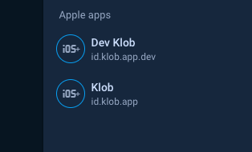

### 2. Create directory each flavors
Create directory on **`ios/config/<your-flavors>`** and locate your Firebase config to directory based on your flavors.

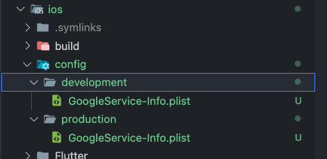

### 3. Create script to copy firebase config
This is for copy config to the correct location based on build.

- Go to `Target`, Select `Runner` -> `Build Phase`, click icon `+` to create new script, name script as `Copy GoogleService-Info.plist`, paste the code below

  ```shell
  environment="default"

  # Regex to extract the scheme name from the Build Configuration
  # We have named our Build Configurations as Debug-dev, Debug-prod etc.
  # Here, dev and prod are the scheme names. This kind of naming is required by Flutter for flavors to work.
  # We are using the $CONFIGURATION variable available in the XCode build environment to extract 
  # the environment (or flavor)
  # For eg.
  # If CONFIGURATION="Debug-prod", then environment will get set to "prod".
  if [[ $CONFIGURATION =~ -([^-]*)$ ]]; then
  environment=${BASH_REMATCH[1]}
  fi

  echo $environment

  # Name and path of the resource we're copying
  GOOGLESERVICE_INFO_PLIST=GoogleService-Info.plist
  GOOGLESERVICE_INFO_FILE=${PROJECT_DIR}/config/${environment}/${GOOGLESERVICE_INFO_PLIST}

  # Make sure GoogleService-Info.plist exists
  echo "Looking for ${GOOGLESERVICE_INFO_PLIST} in ${GOOGLESERVICE_INFO_FILE}"
  if [ ! -f $GOOGLESERVICE_INFO_FILE ]
  then
  echo "No GoogleService-Info.plist found. Please ensure it's in the proper directory."
  exit 1
  fi

  # Get a reference to the destination location for the GoogleService-Info.plist
  # This is the default location where Firebase init code expects to find GoogleServices-Info.plist file
  PLIST_DESTINATION=${BUILT_PRODUCTS_DIR}/${PRODUCT_NAME}.app
  echo "Will copy ${GOOGLESERVICE_INFO_PLIST} to final destination: ${PLIST_DESTINATION}"

  # Copy over the prod GoogleService-Info.plist for Release builds
  cp "${GOOGLESERVICE_INFO_FILE}" "${PLIST_DESTINATION}"
  ```

- Locate the script below `Link Binary With Libraries`.
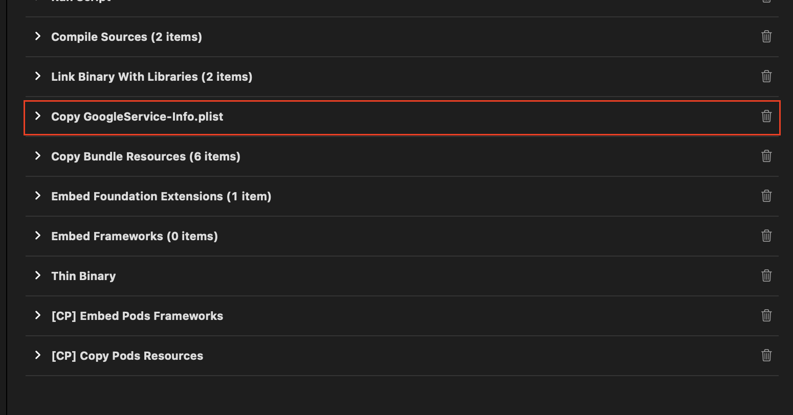


### 4. Create iOS schemas
- Let's make some changes to our configuration on xcode
  
  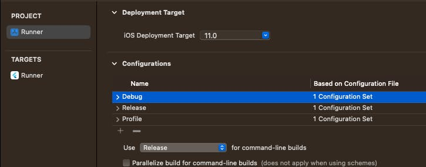

- In Project Runner, rename `Debug`, `Release`, and `Profile` adding `-production` suffixes to each.
  
  

- Once done, we will now create these 3 files for `development` as well. You can use duplicate.
  
  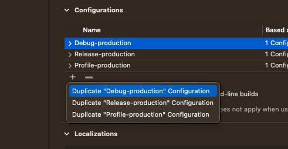
  
- Once done, we will have 6 configurations, 3 for each flavor.
  
  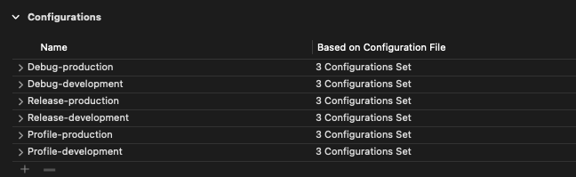
  
- Select the Runner scheme and click the Manage Schemes button.
  
  
  
- Once, there rename Runner scheme to `production`, and duplicate `production` to new `development`.
  
  
  
- Make sure to add the correct build configuration while duplicating.
  
  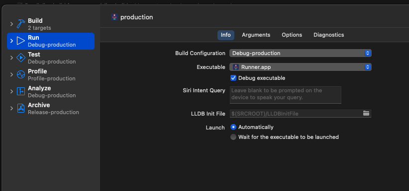

  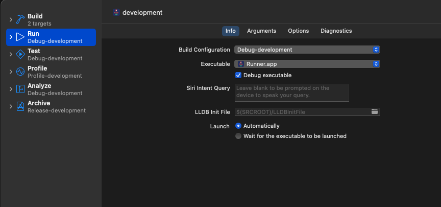
  
- Once you are done with schemes, you will have something like this.
  
  
  
- Now, let's add the bundle identifier for each configuration. In `Target` -> `Runner`, click `Build Settings` and search for `Product Bundle Identifier`.
  
  

- Add the suffix as required.
  
  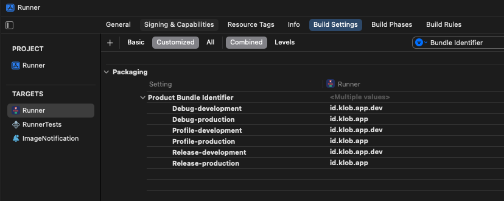
  
- Finally, we will create a new User Defined Variable called `APP_DISPLAY_NAME` which will have a different name for each configuration. In same `Target` -> `Runner` -> `Build Settings`, click on the `+` button, and create a new user-defined variable.
  
  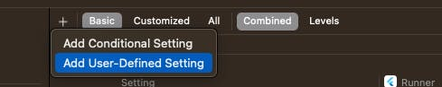

  

- Once, you are done with the user-defined variable, you need to change the `Info.plist` to use this variable.
  
  ```js title=ios/Runner/Info.plist
  ...
  <key>CFBundleDisplayName</key>
  <string>$(APP_DISPLAY_NAME)</string>
  ...
  ```

### 5. Run flavor with command

```shell
# flavor development
flutter run --flavor development --dart-define=ENVIRONMENT=DEV

# flavor production
flutter run --flavor production --dart-define=ENVIRONMENT=PROD
```

or if you're using VS Code, [use this](./flavors#launch-flavor-for-vs-code).


## App Icons for Android and iOS

We will use [flutter_launcher_icons](https://pub.dev/packages/flutter_launcher_icons) to generate the launch icons for each flavor.

- create `flutter_launcher_icons-<flavor>.yaml` files for each flavor.
  
  ```js title=<ROOT>/flutter_launcher_icons-development.yaml
  flutter_icons:
  android: true
  ios: true
  remove_alpha_ios: true
  image_path: "assets/images/dev-icon`.png"
  ```

  ```js title=<ROOT>/flutter_launcher_icons-production.yaml
  flutter_icons:
  android: "ic_laucher"
  ios: true
  remove_alpha_ios: true
  image_path: "assets/images/klob-ios.png"
  image_path_android: "assets/images/klob-android.png"
  ```

- Generate the launch icons we need to run
  
  ```shell
  flutter pub run flutter_launcher_icons:main -f flutter_launcher_icons-*
  ```

- In Android this will auto genereated the directories for each flavor, and we will set the iOS icons to be dynamic in Xcode. In `Runner` -> `Assets.xcassets` we can see that we have all the required icons.
  
- In `Target`-> `Runner` -> `Build Settings`, search for `primary app icon`.
  
  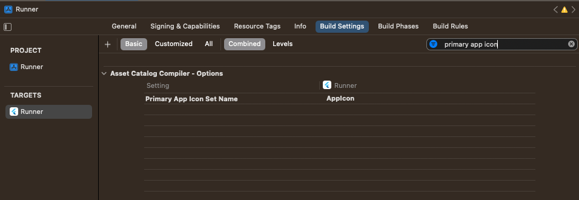

- Set the corresponding suffix to each one.

  

- Done, build with [command](./flavors#4-run-flavor-with-command) or [this](./flavors#launch-flavor-for-vs-code)


## Launch Flavor for VS Code

Create a new file in `.vscode/launch.json` with the following content.


```json title=.vscode/launch.json
{
    "version": "0.2.0",
    "configurations": [
      {
        "name": "DEV | DEBUG",
        "request": "launch",
        "type": "dart",
        "program": "lib/main.dart",
        "args": [
          "--flavor",
          "development",
          "--dart-define=ENVIRONMENT=DEV",
        ],
        "flutterMode": "debug"
      },
      {
        "name": "DEV | RELEASE",
        "request": "launch",
        "type": "dart",
        "program": "lib/main.dart",
        "args": [
          "--flavor",
          "development",
          "--dart-define=ENVIRONMENT=DEV",
        ],
        "flutterMode": "release"
      },
      {
        "name": "PROD | DEBUG",
        "request": "launch",
        "type": "dart",
        "program": "lib/main.dart",
        "args": [
          "--flavor",
          "production",
          "--dart-define=ENVIRONMENT=PROD",
        ],
        "flutterMode": "debug"
      },
      {
        "name": "PROD | RELEASE",
        "request": "launch",
        "type": "dart",
        "program": "lib/main.dart",
        "args": [
          "--flavor",
          "production",
          "--dart-define=ENVIRONMENT=PROD",
        ],
        "flutterMode": "release"
      },
      
    ]
  }
```

## Build App With Flavors
### Build Android
- Build `APK DEV` with command
  ```shell 
  flutter build apk --flavor development --dart-define=ENVIRONMENT=DEV
  ```

- Build `AppBundle DEV` with command
  ```shell 
  flutter build appbundle --flavor development --dart-define=ENVIRONMENT=DEV
  ```

- Build `APK PROD` with command
  ```shell 
  flutter build apk --flavor production --dart-define=ENVIRONMENT=PROD
  ```

- Build `AppBundle PROD` with command
  ```shell 
  flutter build appbundle --flavor production --dart-define=ENVIRONMENT=PROD
  ```

### Build iOS
- Build `IPA DEV with DEV METHOD` with command
  ```shell 
  flutter build ipa --flavor development --dart-define=ENVIRONMENT=DEV --export-options-plist=ios/exportDevOptions.plist 
  ```

- Build `IPA PROD with DEV METHOD` with command
  ```shell 
  flutter build ipa --flavor production --dart-define=ENVIRONMENT=PROD --export-options-plist=ios/exportProdOptions.plist 
  ```

- Build `IPA PROD with APPSTORE METHOD` with command
  ```shell 
  flutter build ipa --flavor production --dart-define=ENVIRONMENT=PROD --export-options-plist=ios/exportAppStoreOptions.plist 
  ```

:::info
`DEV METHOD` is build with development certificate

`APPSTORE METHOD` is build with app-store certificate
:::

:::info
`exportDevOptions.plist`, `exportProdOptions.plist` and `exportAppStoreOptions.plist` must be available first.

```xml title='DEV METHOD OPTIONS'
<?xml version="1.0" encoding="UTF-8"?>
<!DOCTYPE plist PUBLIC “-//Apple//DTD PLIST 1.0//EN” “http://www.apple.com/DTDs/PropertyList-1.0.dtd">
<plist version="1.0">
    <dict>
        <key>method</key>
        <string>development</string>
        <key>teamID</key>
        <string>[Your Team ID]</string>
        <key>provisioningProfiles</key>
        <dict>
            <key>[Your ID]</key>
            <string>[Your Provisioning Profile Name]</string>
            <key>[Your ID]</key>
            <string>[Your Provisioning Profile Name]</string>
            .
            .
            .
        </dict>
    </dict>
</plist>
```

```xml title='APPSTORE METHOD OPTIONS'
<?xml version="1.0" encoding="UTF-8"?>
<!DOCTYPE plist PUBLIC “-//Apple//DTD PLIST 1.0//EN” “http://www.apple.com/DTDs/PropertyList-1.0.dtd">
<plist version="1.0">
    <dict>
        <key>method</key>
        <string>app-store</string>
        <key>teamID</key>
        <string>[Your Team ID]</string>
        <key>provisioningProfiles</key>
        <dict>
            <key>[Your ID]</key>
            <string>[Your Provisioning Profile Name]</string>
            <key>[Your ID]</key>
            <string>[Your Provisioning Profile Name]</string>
            .
            .
            .
        </dict>
    </dict>
</plist>
```
:::

## Services That Need To be Reconfigured

Services that need to be considered when using flavors to reconfigure *if using it*, there are:

### Firebase Cloud Messaging

#### Android
- On Firebase Console, Ensure all flavor has registered on firebase app
  
  

- On [Google cloud console](https://console.cloud.google.com/), go to `credentials` see `API Keys` section and `select your API Key for android`, then add your new bundle id on `restrictions` section based on flavor

  

- Still on `credentials` section, `create new credentials` select `OAuth Client ID` , Select `Application Type` as `Android`, Fill `Name`, `Package Name` & `SHA-1` based on your flavor, then save.
  
  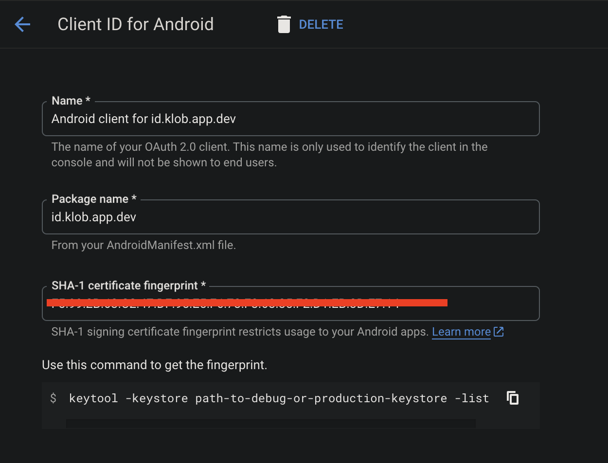

- Back to your `Firebase Console`, and download again each config and place it on flavor directory. Make sure firebase config is placed at correct flavor

- Finally test FCM notification.

#### iOS
- On Firebase Console, Ensure all flavor has registered on firebase app
  
  

- Still on `Firebase Console`, go to `Cloud Messaging` section, and scroll to `Apple App Configuration` then add `APNs Authentication Key` based on flavor
  
  

- On [Google cloud console](https://console.cloud.google.com/), go to `credentials`, then `create new credentials` select `OAuth Client ID`, Select `Application Type` as `iOS`, Fill `Name`, `Bundle ID` & `TEAM ID` based on your flavor, then save.

  

- Back to your `Firebase Console`, and download again each config and place it on flavor directory. Make sure firebase config is placed at correct flavor

- Finally test FCM notification.


### AppLink

#### Android
- On Firebase Console, Ensure all `SHA certificate fingerprints` has registered on firebase app correctly.
  
- Also on [Google cloud console](https://console.cloud.google.com/), Ensure all `fingerprints` at API Key and OAuth Clien ID

  

  

- Add different `assetlinks.json` based on your flavors, example: 

  - production
    ```json title=assetlinks.json
    [
      {
        "relation": ["delegate_permission/common.handle_all_urls"],
        "target": {
          "namespace": "android_app",
          "package_name": "id.klob.app",
          "sha256_cert_fingerprints": [
            <YOUR-SHA256>
          ]
        }
      },
    ]
    ```
  - development
    ```json title=assetlinks.json for development
    [
      {
        "relation": ["delegate_permission/common.handle_all_urls"],
        "target": {
          "namespace": "android_app",
          "package_name": "id.klob.app.dev",
          "sha256_cert_fingerprints": [
            <YOUR-SHA256>
          ]
        }
      },
    ]
    ```

- Done, test your applink


#### iOS

- Add different `apple-app-site-association` based on your flavors. example:

  - production
    ```json title=apple-app-site-association
    {
      "applinks": {
        "apps": [],
        "details": [
          {
            "appID": "LK2V4CHKTR.id.klob.app",
            "paths": [
               <YOUR-PATHS>
            ]
          }
        ]
      }
    }
    ```
  - development
    ```json title=apple-app-site-association for development
    {
      "applinks": {
        "apps": [],
        "details": [
          {
            "appID": "LK2V4CHKTR.id.klob.app.dev",
            "paths": [
              <YOUR-PATHS>
            ]
          }
        ]
      }
    }
    ```

- Done, test your applink


### Sign In With Google

#### Android
- On [Google cloud console](https://console.cloud.google.com/), ensure all `Bundle ID` and  is registered correctly based on flavor at `Android API Key`

  

- Ensure All flavor `OAuth Client ID` is registered on cloud console.

  

- Done, test the service

#### iOS
- Ensure All flavor `OAuth Client ID` is registered on cloud console.

  

- Go to xcode, `Target` -> `runner` -> `Build Settings`, click on the `+` button, and create a new user-defined variable name it `GOOGLE_INFO_URL`. Then paste the `REVERSED_CLIENT_ID` from `ios/config/<FLAVOR_NAME>/GoogleService-Info.plist` based on scheme
  
  

- Then at `Info.plist` change `CFBundleURLSchemes` became:
  
  ```xml title=Info.plist
  <array>
		<dict>
			<key>CFBundleTypeRole</key>
			<string>Editor</string>
			<key>CFBundleURLSchemes</key>
			<array>
				<string>$(GOOGLE_INFO_URL)</string>
			</array>
		</dict>
	</array>
  ```

- Done, test the service

### Sign In With Apple

#### Android

- On `environment.dart` add new var below:

  ```dart title=lib/core/environment/environment.dart
  @override
  String get appleSignInClientId => Constant.appleSignInClientIdProd;

  @override
  String get appleSignInRedirectUrl => Constant.appleSignInRedirectUrlProd;
  ```

  add all var config on all environment.

  :::note
  `appleSignInClientId` and `appleSignInRedirectUrl` is different between flavor, so the service id is different

  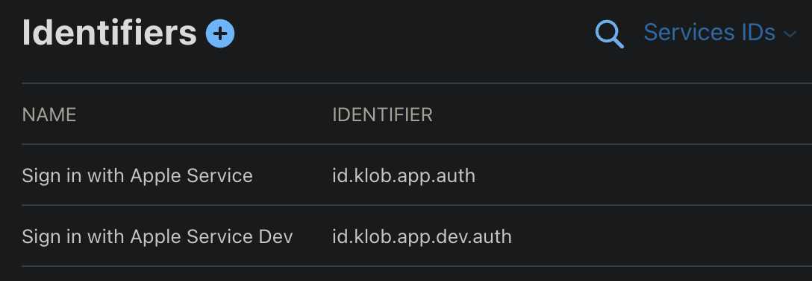
  :::

- Done, test the service

#### iOS

- Ensure on bundle id flavor has capabilities `Sign In with Apple`
  
  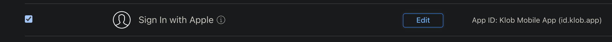
  
- Click edit, and make sure `Group with an existing primary App ID` is selected and primary app ID choose to the prodcution app (*`This is only for non-production, the production one keep as is`*)

  

- Done, test the service

