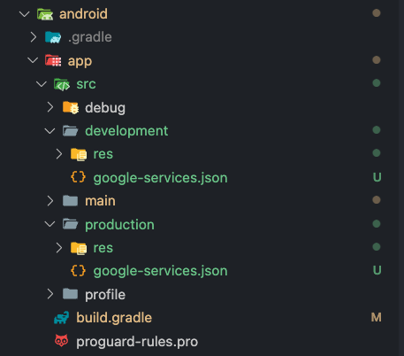

# Flavors

Flavors (known as build configurations in iOS and macOS), allow you (the developer) to create separate environments for your app using the same code base. For example, you might have one flavor for your full-fledged production app, another as a limited "free" app, another for testing experimental features, and so on.

- Flavors allow efficient management of different development environments (development, staging, production)

- Enables creation of multiple versions of the same app (free and paid versions, separate environments for feature development)

- Simplifies setting different parameters (API endpoints, API keys, app icons) for each configuration

- Makes it easier to manage different app versions

## Setting Up Flavors
Manually adding flavors to an app may be the best course of action. This process requires a bit of human touch, but it provides complete control over the configuration of your app's flavors.

We will be setting up **`development`** and **`production`** flavors. 

## Android
### 1. Register bundle id to firebase project
Assume we have created a Firebase Android app before and that is for production, then we must creat new Firebase Android app with new bundle id based on flaver usually has bundle id suffix `.dev`.
If you don't have the Firebase Android app at all, we must add all Firebase Android app to Firebase project based on flavor that we want to config.

We will use **`development`** and **`production`** flavors, so we have 2 Firebase Android app for production and development


### 2. Create directory each flavors
Create directory on **`android/app/src/<your-flavors>`** and locate your Firebase config to directory based on your flavors.



### 3. Add flavors in build.gradle
To add production and development flavors, let's make some changes in the app level build.gradle in **`android/app/build.gradle`** file.
   
   ```js title=android/app/build.gradle
   flavorDimensions 'default'

   productFlavors {
      production {
         dimension 'default'
         resValue "string", "app_name", "Klob"
      }

      development {
         dimension 'default'
         applicationIdSuffix '.dev'
         resValue "string", "app_name", "Klob Dev"
      }
   }
   ```

   The *`flavorDimensions`* line defines the name of the flavor dimension, which is default in this case. Each flavor is defined within the *`productFlavors`* block. The production flavor is the base flavor of the app.

### 4. Run flavor with command

```shell
# flavor development
flutter run --flavor development --dart-define=ENVIRONMENT=DEV

# flavor production
flutter run --flavor production --dart-define=ENVIRONMENT=PROD
```


## iOS
